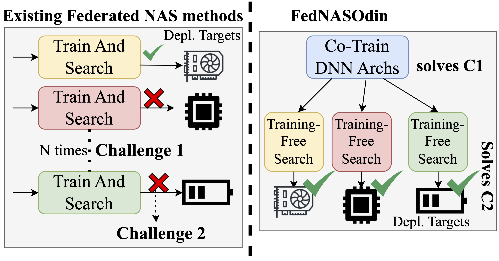
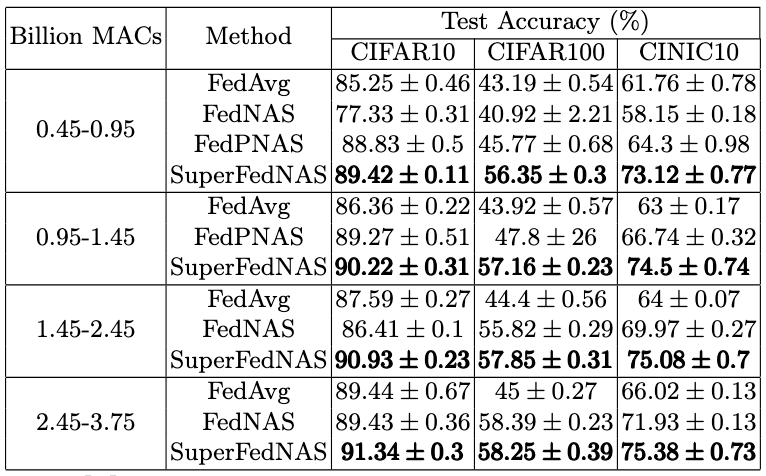
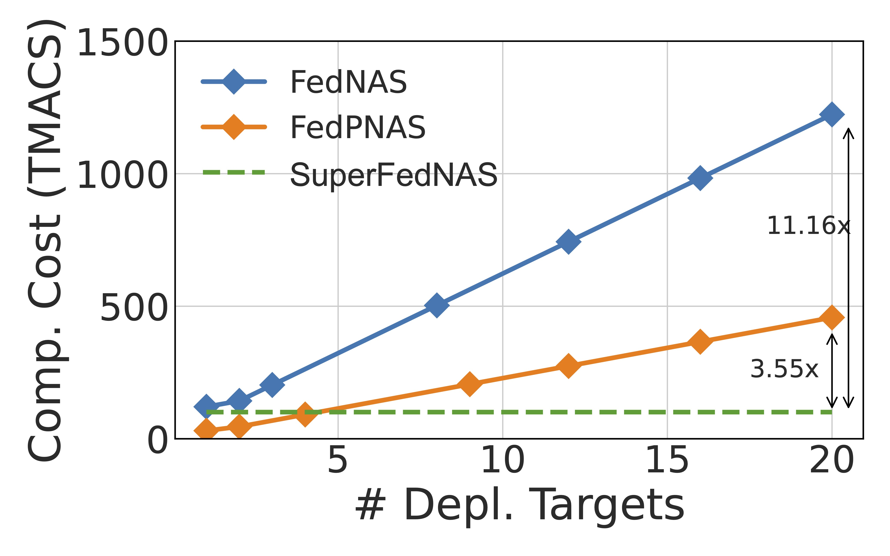
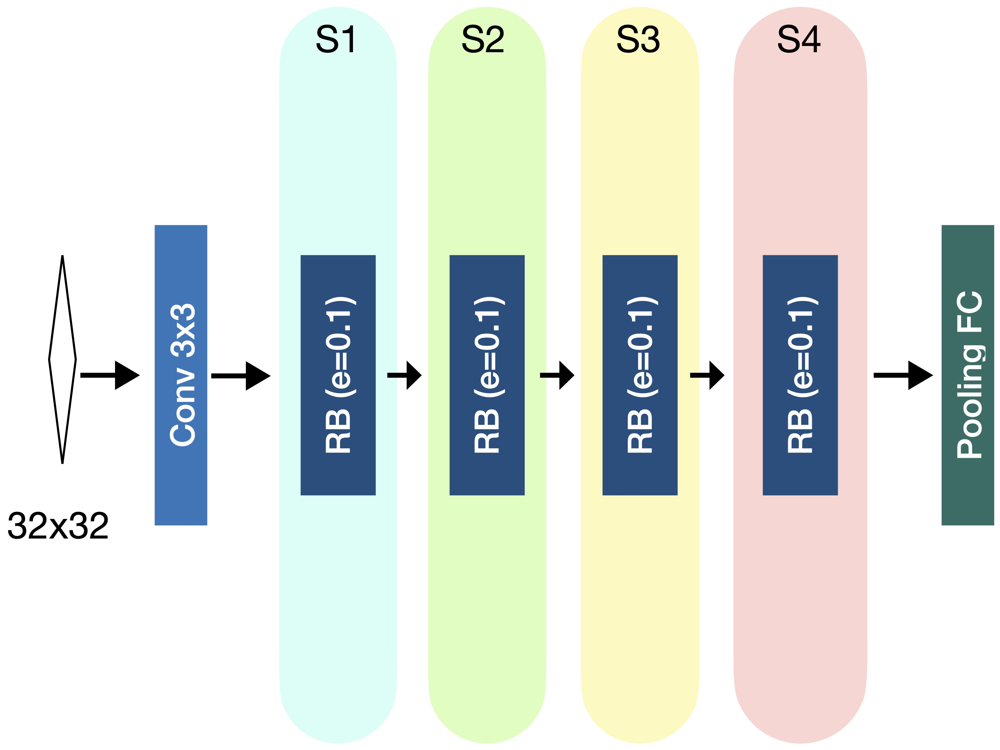
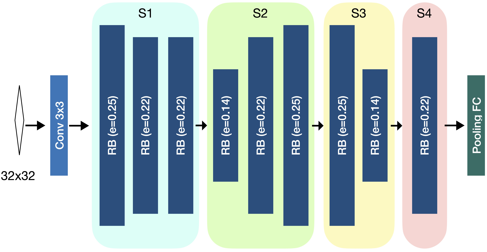

# SuperFedNAS – Cost-Efficient Federated Neural Architecture Search for On-Device Inference


### Accepted as a conference paper at ECCV 2024 [[ArXiv]](https://arxiv.org/abs/2301.10879)
Note: This implementation is adopted from the source code of [FedML](https://github.com/FedML-AI/FedML)

## SuperFedNAS
SuperFedNAS addresses the challenges of performing Neural Architecture Search (NAS) in federated learning settings to satisfy diverse deployment targets whilst tackling the prohibitive training and communication costs. By decoupling training and search in federated NAS, SuperFedNAS significantly lowers training cost for specialized DNNs from O(N) to O(1) for N target deployments. Additionally, SuperFedNAS proposes the MaxNet training algorithm that performs multi-objective federated optimization to co-train a large number of DNN (over half a billion unique DNN) across its clients. 

As discussed in the paper, SuperFedNAS effectively solves two challenges faced by existing FL NAS:
- C1: Existing federated NAS methods are prohibitively expensive to satisfy multiple deployment targets in on-device inference.
- C2: Existing federated NAS methods struggle to produce optimal DNN architectures under inference deployment targets.


## Better Accuracy than Existing Federated NAS Methods


## Produces Specialized DNNs for Target Deployments at less Cost



## SuperFedNAS's Specialized Architectures for Different Deployment Targets
Below we present specialized DNNs found by SuperFedNAS’s search stage on different hardware/latency targets. 
SuperFedNAS finds a more accurate DNN for RTX 2080Ti GPU (91.56%) compared to the AMD CPU (85.25%).
It can be seen that SuperFedNAS’s specialized DNNs are shallow/thin for AMD CPU but wide/deep for GPU.
The following image shows the extracted specialized ResNet DNN architecture extracted by SuperFedNAS during NAS on AMD CPU with a 112ms latency target.

The following image shows the extracted specialized ResNet DNN architecture extracted by SuperFedNAS during NAS on Nvidia RTX 2080 Ti GPU with a 18.2ms latency target.


## Installation
1. Clone repository
2. Either activate conda environment using
```conda env create -f eecv_2024.yml```
or install packages using ```pip install -r requirements.txt```
3. Install image classification datasets under ```flofa/data/cifar10```, ```flofa/data/cifar100``` and ```flofa/data/cinic10```
4. Split the CIFAR10/100 datasets into train, validation and test datasets. This can be done by simply running ```python split_train_validation.py --dataset cifar10/cifar100``` in the ```data``` directory.

## Experiments
Experiments can be run on individual gpus and logged on weights and biases (https://wandb.ai/site). To disable logging to wandb, simply set environment variable ```WANDB_MODE=offline``` to offline mode. Experiments require supplying a wandb project name, entity and run name for logging purposes.

### Running Experiments on CIFAR10, CIFAR100, CINIC10 Datasets
Parameters such as learning rate, batch size, and test frequency have been specified based on experiments from the paper but can be modified as needed.

1. To run experiments, first change directory to ```fedml_experiments/standalone/flofa/```
2. To run fire a weight shared run, use the following command:
   ```
   python train.py --wandb_project_name <WANDB_PROJ_NAME> --wandb_run_name <RUN_NAME> --wandb_entity <WANDB_ENTITY> --gpu <GPU> --dataset <DATASET> --data_dir ./../../../data/<DATASET> --model ofaresnet50_32x32_10_26 --partition_method hetero --client_num_in_total <NUM_CLI> --client_num_per_round <CLI_PER_ROUND> --comm_round <TOTAL_ROUNDS> --epochs <LOCAL_EPOCHS> --batch_size 64 --client_optimizer sgd --lr <LR> --ci 0 --subnet_dist_type <SPAT_TEMP_HEURISTIC> --diverse_subnets '{"0":{"d":[0,0,0,0],"e":0.1},"1":{"d":[0,1,0,1],"e":0.14},"2":{"d":[1,1,1,1],"e":0.18},"3":{"d":[2,2,2,2],"e":0.25}}' --frequency_of_the_test 50 --weighted_avg_schedule '{"type":"<SCHEDULER_NAME>","num_steps":<ROUNDS_TILL_UNIFORM>,"init":<INIT_BETA>,"final":<FINAL_BETA>}' --partition_alpha <ALPHA> --init_seed <INIT_SEED> --efficient_test --verbose
   ```

<details>
<summary>Parameter Description</summary>
<!--All you need is a blank line-->

```
Parameters:
- WANDB_PROJ_NAME: Wandb Project Name
- RUN_NAME: Wandb Run Name
- WANDB_ENTITY: Wandb Entity
- GPU: GPU ID to run on
- DATASET: Select a dataset from [cifar10, cifar100, cinic10]
- NUM_CLI: Total number of clients participating in FL run
- CLI_PER_ROUND: Number of clients randomly sampled to participate in any given round
- TOTAL_ROUNDS: Number of communication rounds to run for
- LOCAL_EPOCHS: Number of epochs that each client should train locally before sending updates to server each communication round
- SPAT_TEMP_HEURISTIC: Spatial temporal heuristic to sample subnetworks. Select one of [static, all_random, sandwich_all_random, TS_all_random].
- SCHEDULER_NAME: Select weighted average scheduler to determine averaging heuristic. Select one of [Uniform, maxnet_linear_all_subnet, maxnet_cos_all_subnet]. 'Uniform' is a weighted average schedule with constant Beta. 'maxnet_linear_all_subnet' is a weighted average schedule that decays Beta linearly to uniform averaging. 'maxnet_cos_all_subnet' is a weighted average schedule that decays Beta using cosine decay to uniform averaging.
- INIT_BETA: Initial beta parameter part of maxnet weighted averaging
- FINAL_BETA: Final beta value to decay to as part of maxnet weighted averaging
- ALPHA: Degree of non-i.i.d. dataset partitioning using Dirichlet distribution (alpha is the hyperparameter of dirichlet distribution).
- INIT_SEED: Seed for random number generator for reproducibility
```
</details>


3. Sample command for running maxnet (FedNASOdin) on cifar10 with alpha 100. There are 20 clients with 8 clients being selected randomly every round (C=0.4) for 1500 rounds. Maxnet parameters: Initial Beta is 0.9 with cosine decay over a period of 80% (1200/1500)

```
python train.py --wandb_project_name <WANDB_PROJ_NAME> --wandb_run_name <RUN_NAME> --wandb_entity <WANDB_ENTITY> --gpu 1 --dataset cifar10 --data_dir ./../../../data/cifar10 --model ofaresnet50_32x32_10_26 --partition_method hetero --client_num_in_total 20 --client_num_per_round 8 --comm_round 1500 --epochs 5 --batch_size 64 --client_optimizer sgd --lr 0.1 --ci 0 --subnet_dist_type TS_all_random --diverse_subnets {"0":{"d":[0,0,0,0],"e":0.1},"1":{"d":[0,1,0,1],"e":0.14},"2":{"d":[1,1,1,1],"e":0.18},"3":{"d":[2,2,2,2],"e":0.25}} --frequency_of_the_test 50 --weighted_avg_schedule {"type":"maxnet_cos_all_subnet","num_steps":1200,"init":0.9,"final":0.125} --partition_alpha 100 --init_seed 0 --efficient_test --verbose
```

4. Note that we can run fedavg runs (a special case of FedNASOdin) by specifying a single subnet in diverse_subnets and selecting "static" subnet_dist_type. The following command is a sample command for running fedavg on the largest subnetwork architecture (d=[2,2,2,2], e=0.25) on cifar10 with alpha 100. There are 20 clients with 8 clients being selected randomly every round (C=0.4) for 1500 rounds.

```
python train.py --wandb_project_name <WANDB_PROJ_NAME> --wandb_run_name <RUN_NAME> --wandb_entity <WANDB_ENTITY> --gpu 0 --dataset cifar10 --data_dir ./../../../data/cifar10 --model ofaresnet50_32x32_10_26 --partition_method hetero --client_num_in_total 20 --client_num_per_round 8 --comm_round 1500 --epochs 5 --batch_size 64 --client_optimizer sgd --lr 0.1 --ci 0 --subnet_dist_type static --diverse_subnets {"0":{"d":[2,2,2,2],"e":0.25}} --frequency_of_the_test 50 --partition_alpha 100 --init_seed 0 --efficient_test --verbose
```

## Searching Trained Network
The following command can be used to run NAS on a trained weight-shared model checkpoint. Before running NAS, the checkpointed model path and latency buckets to perform NAS must be specified in ```nas/run_NAS.py``` under the variables ```CKPT_PATH``` and ```hardware_latency``` respectively.
In the ```nas``` directory, run the following command:

```
python run_NAS -t <TARGET_HARDWARE> --output <OUTPUT_PATH> --evo_population <EVO_POPULATION> --evo_generations <EVO_GENERATIONS> --evo_ratio <EVO_RATIO>
```
<details>
<summary>Parameter Description</summary>
<!--All you need is a blank line-->

```
Parameters:
- TARGET_HARDWARE: Hardware to run NAS on. Select one of ['gpu', 'cpu'].
- OUTPUT_PATH: Path to directory to output NAS results
- EVO_POPULATION: The size of population in each generation
- EVO_GENERATIONS: How many generations of population to be searched and run NAS for
- EVO_RATIO: The ratio of top performing subnetworks that are used as parents for the next generation
```
</details>

## Citation
If you find SuperFedNAS useful for your work, please cite it using:
```bibtex
@inproceedings{superfednas-eccv24,
  author = {Alind Khare and Animesh Agrawal and Aditya Annavajjala and Payman Behnam and Myungjin Lee and Hugo Latapie and Alexey Tumanov},
  title = {{S}uper{F}ed{NAS}: Cost-Efficient Federated Neural Architecture Search for On-Device Inference},  
  booktitle = {Proc. of the 18th European Conference on Computer Vision},
  series = {ECCV '24},
  month = {August},
  year = {2024},
  url = {https://arxiv.org/abs/2301.10879}
}
```
